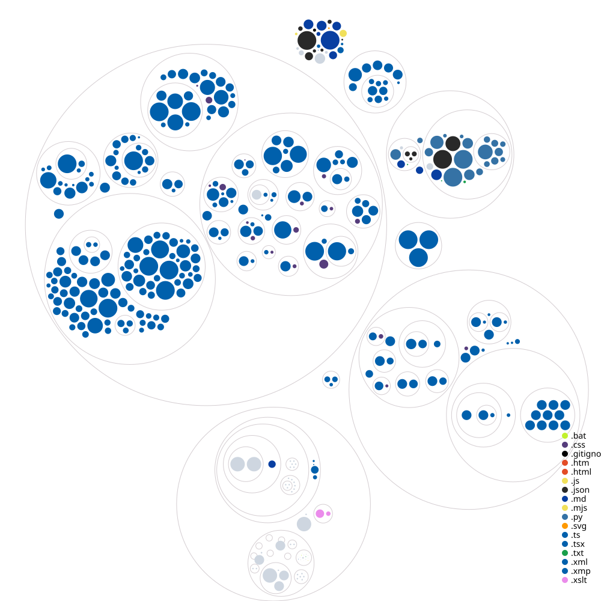

# history

Your personal **history** storyboarded with photo and video albums. Associate photos with their meta data including geocode, caption... in XML albums.
* Enhanced privacy as photos are stored locally not in the cloud
* Plot thumbnails on a map
* Includes administration tools for XML generation

## Project Status:
| Service | Status |
|---|---|
| Deployed | [TEST](https://history.domaindesign.ca/) |
| Security |  |
| Test Coverage |  |
| License |  |

## Installation

### Development
1. Node.js via [nvm](https://github.com/nvm-sh/nvm)
1. Install project dependencies `npm ci`

#### How-to run on LOCAL
1. `npm run dev` will standup both the frontend and backend
1. View address in browser (printed in terminal on successful load)
1. Start the image classifier in /apps/api for the Admin > Edit Album page

#### MCP server
- `npm run dev` also exposes the same server over streaming HTTP at `http://localhost:3030/mcp`; clients that require HTTPS must use a deployed HTTPS `/mcp` endpoint instead, or use stdio locally `npm run mcp`
- `mcp.json` is intentionally stdio-only for local clients so the toolset does not drift between a live Next dev server and a separate stdio process
- If you want to test the streaming HTTP transport, connect directly to `http://localhost:3030/mcp` instead of adding a second local server entry alongside stdio

- For VS Code workspace configuration, use /vscode-mcp.json and `Install Server from Manifest`

#### How-to build for PROD
1. `npm run build` Bundle JavaScript files, and pre-compile
1. `npm start` Run built app
1. View address in browser (printed in terminal on successful load)

## Changelog of releases
See [CHANGELOG](CHANGELOG.md)

## Contributing to this open-source project
See [CONTRIBUTING](api/CONTRIBUTING.md)

## Copyright
See [LICENSE](LICENSE)

## Visualization

