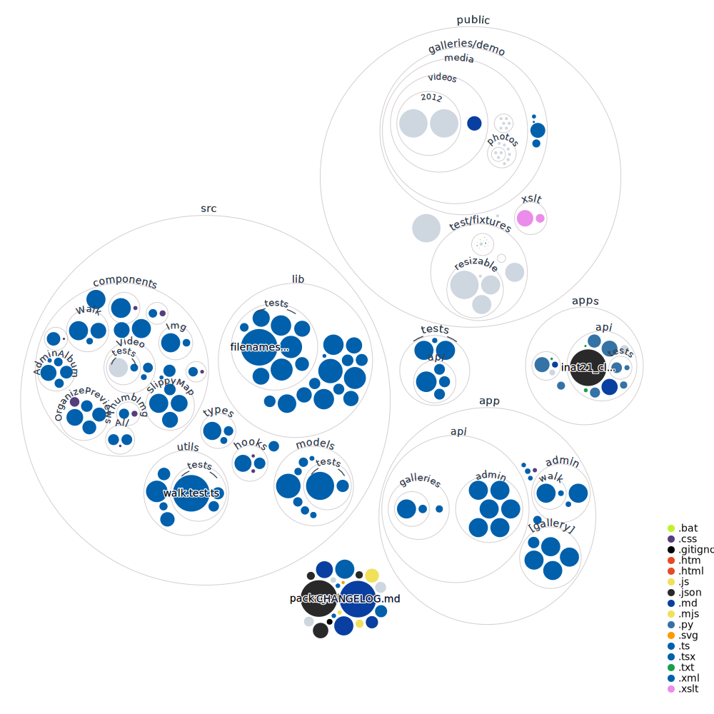

# history

Your personal **history** storyboarded with photo and video albums. Associate photos with their meta data including geocode, caption... in XML albums.
* Enhanced privacy as photos are stored locally not in the cloud
* Plot thumbnails on a map
* Includes administration tools for XML generation

## Project Status:
| Service | Status |
|---|---|
| Deployed | [TEST](https://history.domaindesign.ca/) |
| Security |  |
| Test Coverage |  |
| License |  |

## Installation

### Development
1. Node.js v18 LTS [Download](https://nodejs.org/)
2. Install project dependencies `npm ci`

#### How-to run on LOCAL
3. `npm run dev` will standup both the frontend and backend
4. View address in browser (printed in terminal on successful load)

#### How-to build for PROD
3. `npm run build` Bundle JavaScript files, and pre-compile
4. `npm start` Run built app
5. View address in browser (printed in terminal on successful load)

### Legacy Development
1. Node.js v12 [Download](https://nodejs.org/)
1. Folder **api** is the backend; **ui** is the frontend
1. Install project dependencies `npm ci`
1. Optional [configuration](#environment-configuration)
1. Start web server `npm start`
1. View address in browser (printed in terminal on successful load)

#### Environment configuration
1. Create a `.env` file in the project root
1. To enable Dropbox for hosting photos place Dropbox API v2 access token `HISTORY_DROPBOX_ACCESS_TOKEN=`

## Changelog of releases
See [CHANGELOG](CHANGELOG.md)

## Contributing to this open-source project
See [CONTRIBUTING](api/CONTRIBUTING.md)

## Copyright
See [LICENSE](LICENSE)

## Visualization

